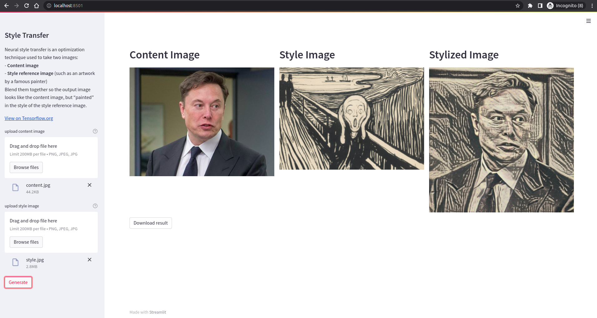

# Style Transfer web app

Streamlit web app to try Style Transfer model from [Tensorflow Hub](https://www.tensorflow.org/hub/tutorials/tf2_arbitrary_image_stylization)

https://t-sarayu-nst-style-transfer-dkcrp6.streamlitapp.com/

1. Upload content image- image you need to edit
2. Download images in TOP style folder (https://github.com/t-sarayu/NST/tree/main/TOP_styles)
eg:mosaic style -  https://github.com/t-sarayu/NST/blob/main/TOP_styles/mosaic.jpg
and Generate

## Screenshots



## Requirements

```python
matplotlib==3.5.1
numpy==1.22.3
Pillow==9.1.0
streamlit==1.8.1
tensorflow-cpu==2.8.0
tensorflow_hub==0.12.0
```

## Installation

```bash
git clone <this repo>
cd style-transfer
pip install -r requirements.txt
streamlit run style_transfer.py
```

The app should be running in <http://localhost:8501>.
